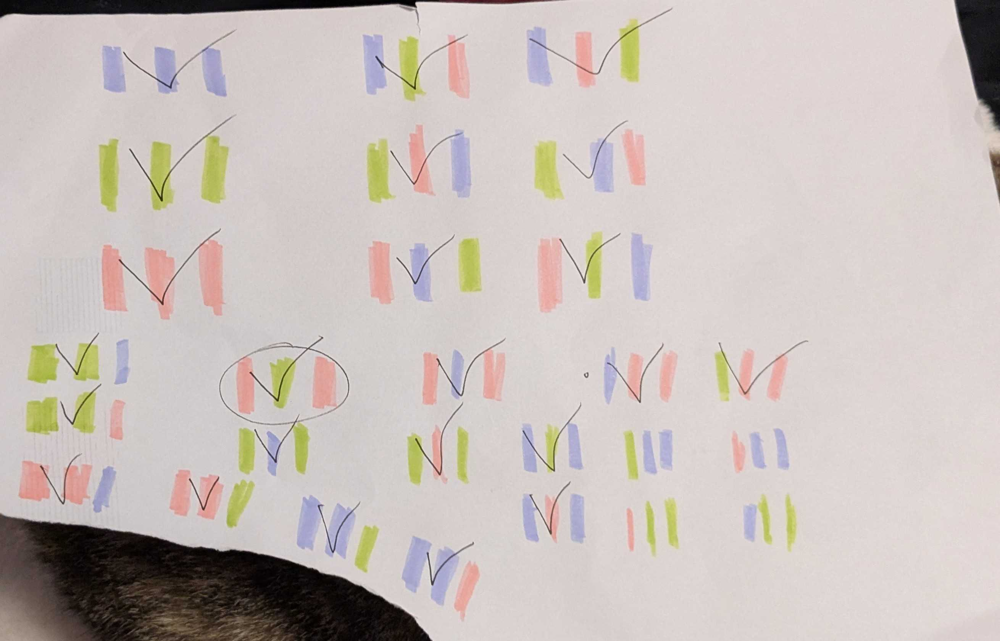

# Project Instructions
Follow the instructions here: https://vuxcode.netlify.app/new/pr1/lessons/major-project-brief/

REMEMBER TO "COMMIT" YOUR CHANGES REGULARLY TO SHOW HOW YOU HAVE BUILT THIS PROJECT! 

The final program is not the goal! The aim of the project is to show how you have developed your program, the steps you have taken and the problems you have solved!

# Project Notes

> You can use this section of the file to keep notes about your project as you work on it.

I've ended up writing my notes mainly in my time-report file. It has been an intersting experience of entangling and detangling my brain only for me to either figure it out on my own by leaving the problem be and coming up with a solution when im taking a shower, am about to fall asleep or doing dishes. Or realizing i was making things too complicated for myself or missed a simple solution because i got too focused on fixing the problem in one way only. 
Since i took so long to ad the full story the last week/s of my project went to making else if statements for every possible button combination so every bit of story id written would appear as it should. I ended up doing A LOT of testing and making else ifs, did kinda get into the rythm with it after doing it so many times at least.

# Project Summary

> Before the final submission date you should include a "PROJECT SUMMARY" in this section here. 

My project was to make a text based adventure game, I wanted to make a functional program first with some pleasant visual flairs like custom buttons, different fonts and the like after. But at some point I got a bit sucked into how changing the size, shape and color of text and buttons worked so i ended up doing some of visuals over the function at about the halfway point. This project has been a sturdy example for me on how the code is affected by my brains state of mind the day i work on it. 
For example I would sometimes make simple mistakes such as missing adding a . or (). Or to fix the problem of all the dialogue for button one appearing all at once no matter what, i tried to disable and enable the buttons in a weird way or adding a button for each option instead of just using if statements or something. It has been good practice for me to remember to test the program every time i made a change., as earlier in the course i tended to write as much code as I could and test it after but that (for obvious reasons) made it hard to know where id made a mistake so i could fix the problem.

A pretty obvious thing i would improve it with if i had more time would be to add even more options and possible endings.
One idea I had was that at each ending the player would get a clue or maybe one or two letters for a password they could input into the same textbox they inserted the name and be given a secret ending. 
Aside from that I think i wouldve gone with a different story than the more generic 'stuck in a dungeon; find a way out' story. But me going back and forth with what sort of story to write sucked so much of my time and hindered me from seeing if the program worked as it should so i decided to just go with something simple and go from there.

I did not end up sticking to the projects time budget in the slightest. I have ADHD so my brain has a tendency to get distracted or end up hyperfocusing on a specific thing for far too long. I would end up avoiding working on the project but still think anout that i should do it but not doing it. Basically getting trapped in -inactive anxious over not being active- limbo. During October i had no proper written out schedule or timers to to have specific times writen out for when i was suposed to be working and not. Towards mid/late Nov I had more control to concentrate thanks to designated hours, non distracting music (though towards the end it was more stimulating but non distracting music like Time Paradox on 1 hour loop) and making a habit + timers, still hard though.

# User Guide

> Write a clear user guide for how someone should use your program.

To get the begining of the story write in a name in the text box and click 'Confirm'. After that a text box will appear telling the first part of the story and presenting the options available to you in the form of the three buttons below marked as 'Option 1/2/3'. Simply choose one of the 3 options and click the corresponding button, read the text that pops up and then chose a button again til you reach an ending (Currently there is only enough story for 3 button presses). If it says'Everything goes dark/black' or 'You feel you are left with more questions than answers'that means that story branch is now over. If you want to reset the game simply push the 'Reset Everything' button. And if that fails somehow, just reload the page.